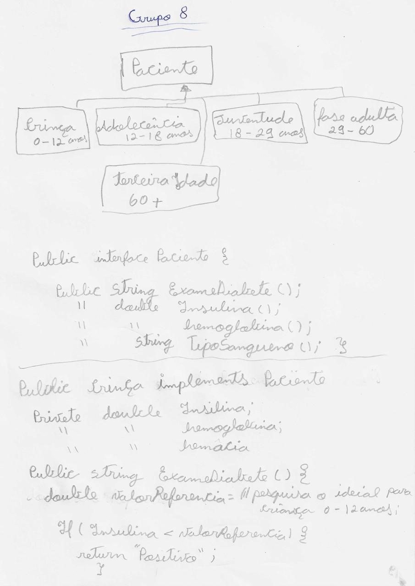
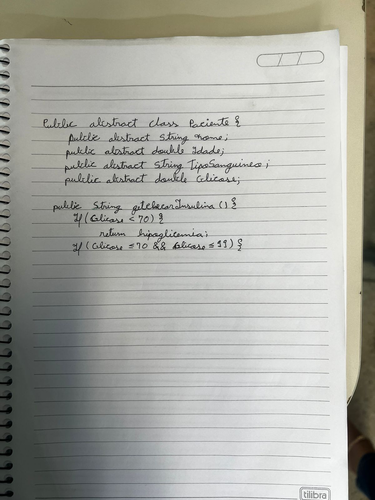

## Descrição do Projeto
O hemograma completo é vital para avaliar a saúde geral, mas muitos laboratórios ainda utilizam métodos manuais ou sistemas antigos, resultando em erros e processos lentos. A falta de automação limita análises avançadas e relatórios rápidos, evidenciando a necessidade de software que automatize a coleta, análise e armazenamento de dados hematológicos, melhorando a eficiência e precisão dos resultados. Nosso projeto é desenvolver este software em Java.

## Ata de Reunião 
[Ata de Reunião 06-07](https://drive.google.com/file/d/1U_qxZ6KSISEop4Qc7nDjU3sI09LakXI9/view?usp=drivesdk)

## Desenhos e Rascunhos

### Esquema de classes

### Esquema de código 

